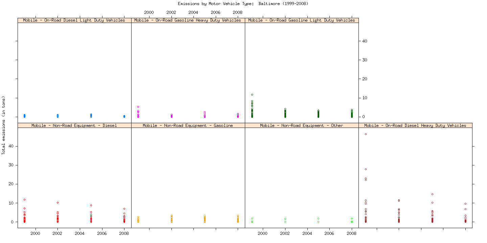

This is an R Markdown document. Markdown is a simple formatting syntax for authoring HTML, PDF, and MS Word documents. For more details on using R Markdown see <http://rmarkdown.rstudio.com>.

When you click the **Knit** button a document will be generated that includes both content as well as the output of any embedded R code chunks within the document. You can embed an R code chunk like this:

```{r}
summary(cars)
```

You can also embed plots, for example:

```{r, echo=FALSE}
plot(cars)
```

Note that the `echo = FALSE` parameter was added to the code chunk to prevent printing of the R code that generated the plot.

There were `r nrow(mtcars)` cars studied

[linked phrase](http://example.com)



A friend once said:

> It's always better to give
> than to receive.

```
This text is displayed verbatim / preformatted
```

We defined the `add` function to
compute the sum of two numbers.
LaTeX Equations

$equation$

******
$$ equation $$

First Header  | Second Header
------------- | -------------
Content Cell  | Content Cell
Content Cell  | Content Cell

Reference Style Links and Images

A [linked phrase][id].

#[id]: http://example.com/ "Title"
#Images
#![alt text][id]

[id]: plot2.png "Title"


```{r}
summary(cars)
```
To display the output of a code chunk but not the underlying R code, you specify the echo=FALSE option:

```{r, echo=FALSE}
summary(cars)
```
Note that R code chunks can also be used to render plots. To display a plot while omitting the code used to generate the plot you’d do this:

```{r, echo=FALSE}
plot(cars)
```

```{r, results='asis'}
knitr::kable(mtcars)
```